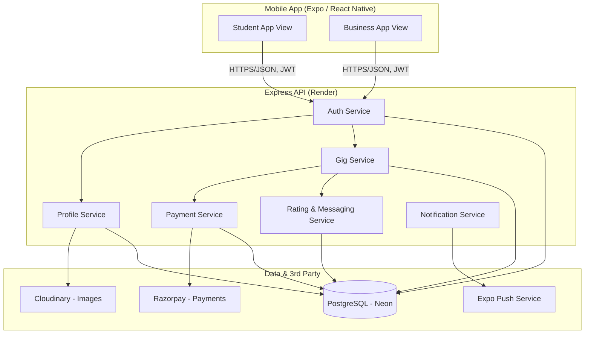
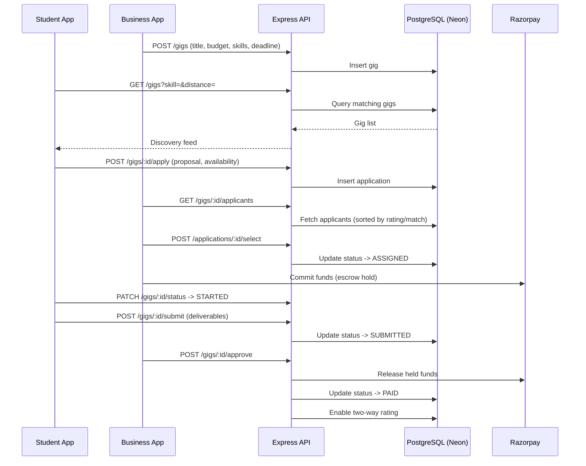
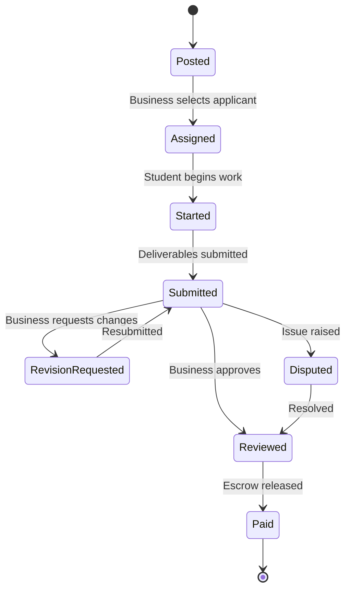

# YuvaConnect

**A hyperlocal micro-gig marketplace connecting verified college students with local businesses/MSMEs for short, paid, skill-based tasks.**

Built as a mobile-first pilot: React Native (Expo) app distributed as a shareable APK, with a free-tier backend for a trial rollout among students and local businesses before scaling further.

---

## Table of Contents

- [Problem & Solution](#problem--solution)
- [Tech Stack](#tech-stack)
- [System Architecture](#system-architecture)
- [Core Data Flow](#core-data-flow)
- [Gig Lifecycle](#gig-lifecycle)
- [Project Structure](#project-structure)
- [Getting Started](#getting-started)
- [Environment Variables](#environment-variables)
- [Build Phases](#build-phases)
- [Deployment](#deployment)

---

## Problem & Solution

Small businesses (kirana stores, salons, cafes, local manufacturers) have small, one-off tasks that don't justify a full hire. College students have the skills but no trustworthy, structured channel to find local, paid, short-term work. YuvaConnect is the trust layer that connects the two: verified profiles, escrow-style protected payments, and two-way ratings, built specifically for short in-person or local tasks — not remote freelance work, not multi-month internships.

---

## Tech Stack

| Layer | Choice | Why |
|---|---|---|
| Mobile app | React Native + Expo (Router, managed workflow) | Fast iteration, EAS Build produces a shareable APK without touching native tooling |
| Backend | Node.js + Express + TypeScript | Lightweight, fast to build, easy to deploy free |
| ORM | Prisma | Type-safe queries, painless migrations |
| Database | PostgreSQL (Neon) | Relational fit for gigs/applications/payments; free tier with no forced expiry |
| Hosting (API) | Render (free web service) | No card required; cold starts on idle, acceptable for pilot |
| Auth | JWT + bcrypt (OTP via Firebase Phone Auth planned) | Simple, stateless, free at this scale |
| Image storage | Cloudinary | Free tier CDN storage for profile/portfolio/gig photos — Render's filesystem is ephemeral |
| Payments | Razorpay (Route/escrow, test mode for pilot) | India-focused, supports hold-and-release marketplace flows |
| Push notifications | Expo Push Notifications | Built into Expo, free |
| State/data (client) | Zustand + TanStack Query | Lightweight local state + robust server-state caching |

---

## System Architecture



---

## Core Data Flow



---

## Gig Lifecycle



---

## Project Structure

```
YuvaConnect/
├── app/                        # Expo Router - file-based routes
│   ├── (auth)/
│   │   ├── login.tsx
│   │   └── signup.tsx
│   ├── (student)/
│   │   ├── feed.tsx
│   │   ├── gig/[id].tsx
│   │   └── profile.tsx
│   ├── (business)/
│   │   ├── post-gig.tsx
│   │   ├── applicants/[gigId].tsx
│   │   └── profile.tsx
│   ├── _layout.tsx
│   └── index.tsx
├── src/
│   ├── api/                    # axios instance, endpoint wrappers
│   ├── components/
│   ├── hooks/                  # TanStack Query hooks
│   ├── store/                  # Zustand stores
│   └── config/                 # app.config.js reads (API base URL, etc.)
├── backend/
│   ├── src/
│   │   ├── routes/
│   │   ├── controllers/
│   │   ├── services/
│   │   ├── middleware/
│   │   └── index.ts
│   ├── prisma/
│   │   └── schema.prisma
│   ├── .env.example
│   └── package.json
├── app.json
├── eas.json
└── README.md
```

---

## Getting Started

### Prerequisites
- Node.js `^20.19.4` or `^22.13.0`+ (Expo SDK 57 requirement)
- Expo Go app on your test device (must match project's SDK version)
- A free [Neon](https://neon.tech) Postgres database
- A free [Render](https://render.com) account
- A free [Cloudinary](https://cloudinary.com) account

### 1. Clone & install
```bash
git clone <repo-url>
cd YuvaConnect
npm install
```

### 2. Backend setup
```bash
cd backend
npm install
cp .env.example .env
# fill in DATABASE_URL (from Neon) and JWT_SECRET
npx prisma migrate dev
npm run dev
```

### 3. Mobile app setup
```bash
cd ..
npx expo start
```
Scan the QR code with Expo Go. Point the app's API base URL (in `src/config`) at your local backend (`http://<your-ip>:PORT`) during development, or at your deployed Render URL once live.

---

## Environment Variables

**`backend/.env`**
```
DATABASE_URL=postgresql://<user>:<password>@<neon-host>/<db>?sslmode=require
JWT_SECRET=<a-long-random-string>
CLOUDINARY_URL=cloudinary://<key>:<secret>@<cloud-name>
RAZORPAY_KEY_ID=<test-mode-key>
RAZORPAY_KEY_SECRET=<test-mode-secret>
PORT=4000
```

**App (`app.config.js` → `extra`)**
```
API_BASE_URL=https://your-app.onrender.com
```

---

## Build Phases

| Phase | Scope |
|---|---|
| 1. Foundation | Repo setup, Express + Prisma + Neon connected & deployed, JWT auth, Expo app skeleton wired to live backend |
| 2. Profiles & Verification | Student/business profile CRUD, Cloudinary image upload, manual verification flow |
| 3. Gig Lifecycle | Posting, discovery feed, applications, status tracker, revisions |
| 4. Payments | Razorpay escrow flow, earnings dashboard |
| 5. Trust & Communication | In-app messaging, ratings, notifications, dispute reporting |
| 6. Pilot Hardening | EAS APK build, bug fixes, saved-talent pool, basic admin view |

---

## Deployment

- **Backend** → Render free web service, connected to this repo's `/backend` folder. Set build command `npm install && npx prisma generate`, start command `npm run start`.
- **Database** → Neon free Postgres, connection string set as `DATABASE_URL` on Render.
- **Mobile app** → `eas build -p android --profile preview` produces a shareable APK for pilot testers (no Play Store submission needed at this stage).
