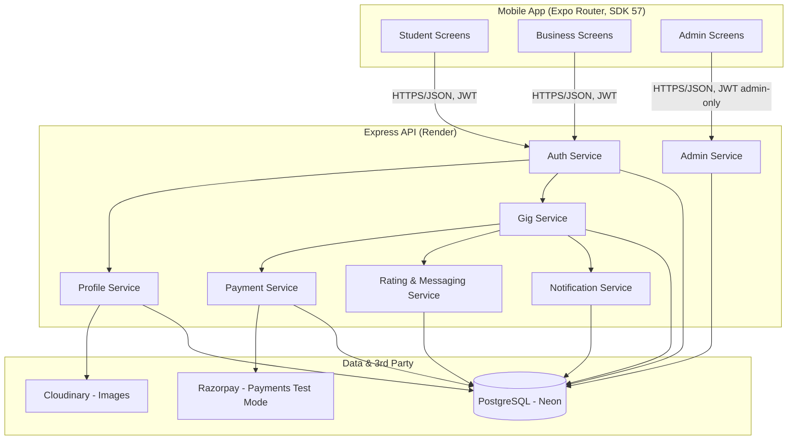
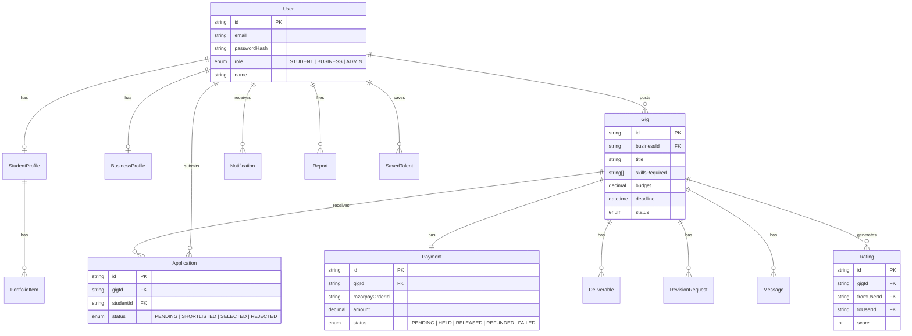
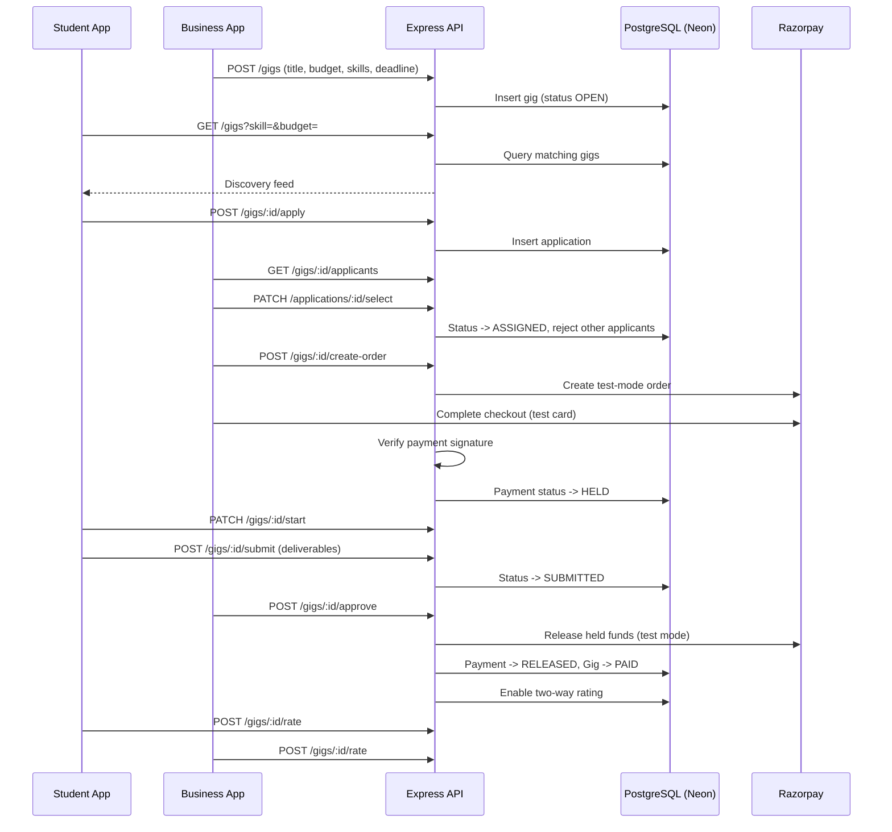
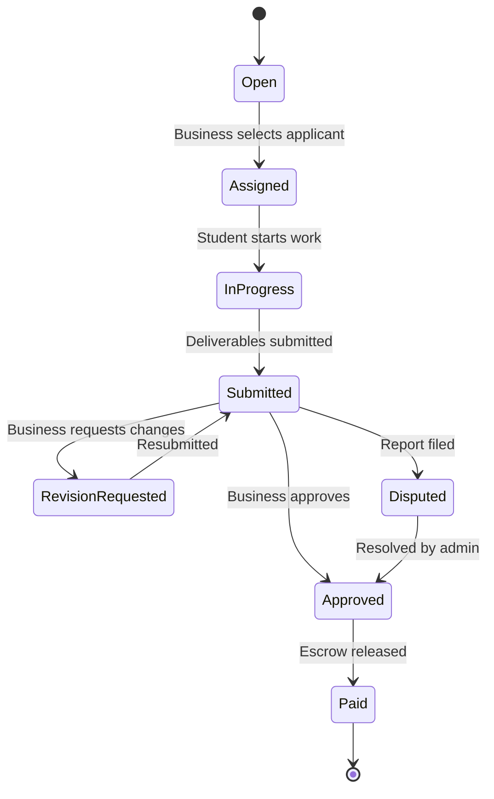

# YuvaConnect

**A hyperlocal micro-gig marketplace connecting verified college students with local businesses/MSMEs for short, paid, skill-based tasks.**

Built as a mobile-first pilot: React Native (Expo, SDK 57) app distributed as a shareable APK, with a free-tier backend for a trial rollout among students and local businesses before scaling further.

---

## Table of Contents

- [Problem & Solution](#problem--solution)
- [Tech Stack](#tech-stack)
- [System Architecture](#system-architecture)
- [Data Model](#data-model)
- [Core Data Flow](#core-data-flow)
- [Gig Lifecycle](#gig-lifecycle)
- [Feature Set by Domain](#feature-set-by-domain)
- [Project Structure](#project-structure)
- [Design System](#design-system)
- [Getting Started](#getting-started)
- [Environment Variables](#environment-variables)
- [Build Phases](#build-phases)
- [Deployment](#deployment)
- [Known Gotchas & Lessons Learned](#known-gotchas--lessons-learned)
- [Known Limitations (Pilot)](#known-limitations-pilot)

---

## Problem & Solution

Small businesses (kirana stores, salons, cafes, local manufacturers) have small, one-off tasks that don't justify a full hire. College students have the skills but no trustworthy, structured channel to find local, paid, short-term work. YuvaConnect is the trust layer that connects the two: verified profiles, escrow-style protected payments, and two-way ratings — built for short, local, often in-person tasks, not remote freelance work or multi-month internships.

---

## Tech Stack

| Layer | Choice | Why |
|---|---|---|
| Mobile app | React Native + Expo (Router, SDK 57, managed workflow) | Fast iteration, EAS Build produces a shareable APK without native tooling |
| Backend | Node.js + Express + TypeScript | Lightweight, fast to build, easy to deploy free |
| ORM | Prisma | Type-safe queries, explicit migrations (does **not** auto-create tables — see gotchas) |
| Database | PostgreSQL (Neon) | Relational fit for gigs/applications/payments; free tier with no forced expiry |
| Hosting (API) | Render (free web service) | No card required; cold starts on idle, acceptable for pilot |
| Auth | JWT + bcrypt | Simple, stateless, free at this scale |
| Image storage | Cloudinary | Free-tier CDN storage for profile/portfolio/gig photos |
| Payments | Razorpay (test mode) | India-focused; Route/escrow-style hold-and-release flow |
| Push/Notifications | In-app notification feed (polling-based) | No WebSocket/push infra needed for pilot scale |
| State/data (client) | Zustand + TanStack Query | Lightweight local state + robust server-state caching |
| Icons | @expo/vector-icons | Bundled with Expo, no extra native setup |

---

## System Architecture



---

## Data Model



---

## Core Data Flow



---

## Gig Lifecycle



---

## Feature Set by Domain

**Student**
- Verified profile, skills, portfolio, availability
- Discovery feed — filter by skill, budget, distance
- Structured application flow (proposal, experience, availability)
- Live status tracker per gig
- Deliverable submission + revision handling
- Earnings dashboard
- Two-way ratings/reviews
- In-app messaging per gig
- Notification feed

**Business**
- Verified business profile
- Gig posting flow
- Applicant comparison view (skill match, rating, past gigs)
- Protected/escrow-style payment flow (Razorpay test mode)
- Work tracker — monitor, request revision, approve, pay
- Saved-talent pool
- In-app messaging, ratings, notifications

**Shared trust & safety**
- JWT auth, bcrypt password hashing
- Manual/admin-driven verification
- Report/dispute flow
- Minimal admin dashboard — resolve reports, verify pending users

---

## Project Structure

```
YuvaConnect/
├── src/
│   ├── app/                    # Expo Router - file-based routes
│   │   ├── (auth)/
│   │   │   ├── login.tsx
│   │   │   └── signup.tsx
│   │   ├── (student)/
│   │   │   ├── feed.tsx
│   │   │   ├── gig/[id].tsx
│   │   │   ├── my-gigs.tsx
│   │   │   ├── earnings.tsx
│   │   │   └── profile.tsx
│   │   ├── (business)/
│   │   │   ├── post-gig.tsx
│   │   │   ├── applicants/[gigId].tsx
│   │   │   ├── talent-pool.tsx
│   │   │   └── profile.tsx
│   │   ├── (admin)/
│   │   │   └── dashboard.tsx
│   │   ├── (shared)/
│   │   │   ├── chat/[gigId].tsx
│   │   │   └── notifications.tsx
│   │   ├── _layout.tsx
│   │   └── index.tsx
│   ├── theme/                  # design tokens (colors, type, spacing)
│   ├── components/             # shared UI: Button, Card, Badge, etc.
│   ├── api/                    # axios instance, endpoint wrappers
│   ├── hooks/                  # TanStack Query hooks
│   ├── store/                  # Zustand stores
│   └── config/                 # app.config.js reads (API base URL, etc.)
├── backend/
│   ├── src/
│   │   ├── routes/
│   │   ├── controllers/
│   │   ├── services/
│   │   ├── middleware/
│   │   ├── config/
│   │   ├── types/
│   │   ├── app.ts
│   │   └── server.ts
│   ├── prisma/
│   │   ├── schema.prisma
│   │   └── migrations/
│   ├── .env.example
│   └── package.json
├── app.config.js
├── app.json
├── eas.json
└── README.md
```

---

## Design System

Phase 7 rebuilds the UI to match a set of FlutterFlow wireframes covering all 35 core screens (student, business, admin, and shared flows). Visual language: clean white cards on a light neutral background, a blue primary accent (`#2563EB`), pill-shaped skill/status chips, verified-badge trust signals, bordered stat-grid cards on detail screens, gradient status banners, and consistent bottom tab navigation.

**STEP 1 — the design system — is built and typechecks clean.** Formal tokens live in `src/theme/` (colour ramps + semantic aliases, an 18-variant type scale, a 4pt spacing grid, radius and `boxShadow` elevation ramps, gradient presets, and a 130-name semantic icon registry over Ionicons from `@expo/vector-icons`). Base components live in `src/components/ui/` and are the only styled primitives screens may use — `GigCard`, `StatBox`/`StatGrid`, `SkillPill`, `StatusBadge`, `VerifiedBadge`, `PrimaryButton`/`SecondaryButton`, `ScreenHeader`, `BottomTabBar`, `SearchBar`, `Banner`, `Avatar`, `TextField`, `SelectableChip`, `SegmentedControl`, `MilestoneStepper`, `CandidateCard`, and the full `EmptyState`/`ErrorState`/`SuccessState`/`LoadingSkeleton` set.

Nothing outside `src/theme/` hardcodes a hex value, font size, padding literal or icon glyph name.

A live reference gallery renders every token and component at the `/design-system` route (a review tool — not linked from any tab or header, and removed once the screen rebuilds are signed off).

Full specification, backend gap register and the wireframe → route map: **[`docs/DESIGN_SYSTEM.md`](docs/DESIGN_SYSTEM.md)**.

---

## Getting Started

### Prerequisites
- Node.js `^20.19.4` or `^22.13.0`+ (Expo SDK 57 requirement)
- Expo Go app on your test device, matching SDK 57
- A free [Neon](https://neon.tech) Postgres database
- A free [Render](https://render.com) account
- A free [Cloudinary](https://cloudinary.com) account
- A [Razorpay](https://razorpay.com) account (test mode keys, no KYC needed)

### 1. Clone & install
```bash
git clone <repo-url>
cd YuvaConnect
npm install
```

### 2. Backend setup
```bash
cd backend
npm install
cp .env.example .env
# fill in DATABASE_URL, DIRECT_URL, JWT_SECRET, CLOUDINARY_URL, RAZORPAY keys
npx prisma migrate dev
npm run dev
```

### 3. Mobile app setup
```bash
cd ..
# create a root .env with EXPO_PUBLIC_API_URL pointing at your backend
npx expo start
```
Scan the QR with Expo Go. Both `npm run dev` (backend) and `npx expo start` (app) must run simultaneously during local development — the backend has no persistence beyond the terminal it's running in until deployed to Render.

---

## Environment Variables

**`backend/.env`**
```
DATABASE_URL=postgresql://<user>:<password>@<neon-pooler-host>/<db>?sslmode=require
DIRECT_URL=postgresql://<user>:<password>@<neon-direct-host>/<db>?sslmode=require
JWT_SECRET=<a-long-random-string>
CLOUDINARY_URL=cloudinary://<key>:<secret>@<cloud-name>
RAZORPAY_KEY_ID=<test-mode-key>
RAZORPAY_KEY_SECRET=<test-mode-secret>
PORT=4000
```
`DATABASE_URL` (pooled) is used for normal app queries; `DIRECT_URL` (non-pooled) is required for Prisma migrations — Neon's pooler does not support the transaction behavior migrations need.

**Root `.env` (Expo)**
```
EXPO_PUBLIC_API_URL=https://your-app.onrender.com
```
For local development, temporarily set this to your machine's LAN IP (e.g. `http://192.168.1.36:4000`) — see gotchas below.

---

## Build Phases

| Phase | Scope | Status |
|---|---|---|
| 1. Foundation | Repo setup, Express + Prisma + Neon connected, JWT auth, Expo app skeleton | ✅ Complete |
| 2. Profiles & Verification | Student/business profile CRUD, Cloudinary upload, manual verification | ✅ Complete |
| 3. Gig Lifecycle | Posting, discovery, applications, status tracker, revisions | ✅ Complete |
| 4. Payments | Razorpay test-mode escrow flow, earnings dashboard | ✅ Complete |
| 5. Trust & Communication | Messaging, ratings, notifications, reporting | ✅ Complete |
| 6. Pilot Hardening | Render deployment, saved-talent pool, admin view, EAS APK build | ✅ Complete |
| 7. UI Rebuild | Full visual rebuild matching FlutterFlow wireframes (35 screens) | 🔄 In progress |

---

## Deployment

- **Backend** → Render free web service, connected to `/backend`. Build command: `npm install && npx prisma generate`. Start command: `npm run start`. Set all env vars from the list above directly in Render's dashboard (never commit real secrets).
- **Database** → Neon free Postgres. Run `npx prisma migrate deploy` against `DIRECT_URL` after any schema change, before redeploying the backend.
- **Mobile app** → `eas build -p android --profile preview` produces a shareable APK for pilot testers. Testers will see an "unknown source" warning on install since this isn't distributed via Play Store — this is expected for a pilot.

---

## Known Gotchas & Lessons Learned

These cost real debugging time during the build — documented so they don't get rediscovered:

1. **Prisma does not auto-create tables like MongoDB/Mongoose.** Writing `schema.prisma` only defines the schema in code. You must explicitly run `npx prisma migrate dev --name <description>` for tables to actually exist on the database. Forgetting this looks like "everything is configured correctly but nothing works."

2. **Neon's pooled connection string cannot run migrations.** Using the `-pooler` hostname for `DATABASE_URL` causes `P1017: Server has closed the connection` during `migrate dev`. Fix: add a separate `DIRECT_URL` (non-pooled Neon hostname) and reference it via `directUrl` in `schema.prisma`'s datasource block. App queries keep using the pooled `DATABASE_URL`; only migrations use the direct one.

3. **`10.0.2.2` is an Android-emulator-only address — it does nothing on a physical device.** If `EXPO_PUBLIC_API_URL` defaults to `10.0.2.2`, requests from a real phone silently fail with no backend-side log, since the request never reaches a valid destination. For physical-device local testing, use your machine's actual LAN IP (`ipconfig` → IPv4 Address under your active WiFi adapter) — and remember this IP can change between sessions.

4. **Expo Go is version-locked to a specific SDK.** A project scaffolded on a newer SDK than your installed Expo Go app supports will fail with "Project is incompatible with this version of Expo Go." Either update Expo Go from the Play Store, or match the project's SDK via `npx expo install expo@^<version>.0.0 && npx expo install --fix`.

5. **Backend + app must run simultaneously during local dev.** Until deployed, the Express server only exists while `npm run dev`'s terminal is open. Closing it silently breaks every API call from the app.

6. **Native modules (e.g. Razorpay checkout) break Expo Go compatibility.** Any package requiring native code can't run inside Expo Go's sandbox — it requires an EAS development build (`eas build --profile development`) instead. Always install native-module packages with `npx expo install <package>`, never plain `npm install`, to keep versions aligned with the project's Expo SDK.

---

## Known Limitations (Pilot)

- Razorpay is in **test mode only** — no real payouts; going live requires business KYC/Route setup on Razorpay's side.
- No automated identity verification (Aadhaar/KYC) — verification is currently manual/admin-approved.
- Messaging and notifications are **polling-based**, not real-time (no WebSockets/push infrastructure yet).
- Render's free tier spins down after 15 minutes of inactivity — first request after idle takes ~30–50s (cold start). Expected pilot-tier behavior.
- No geo-distance filtering yet on the discovery feed — filtering is by skill/budget only, distance display is illustrative.
